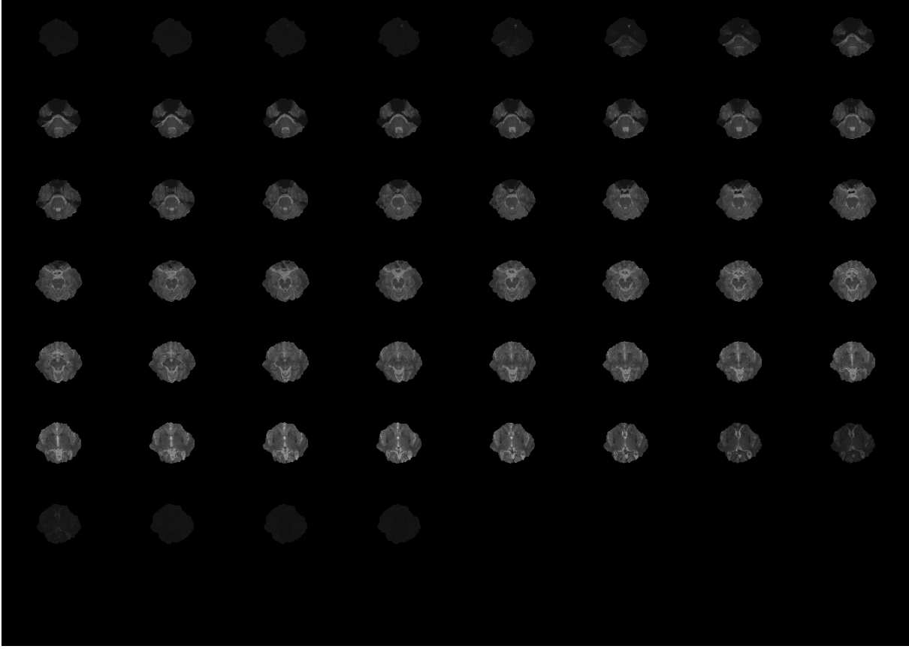
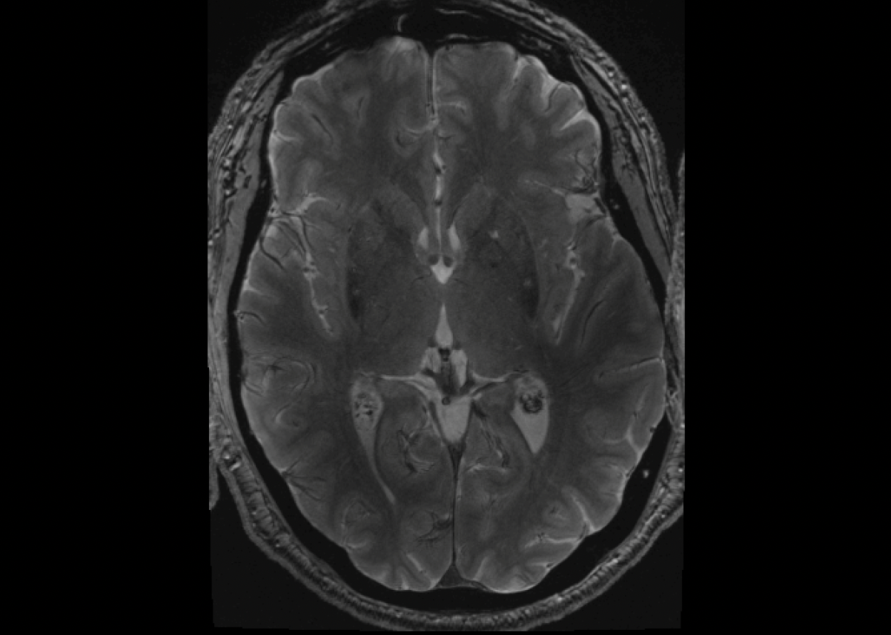
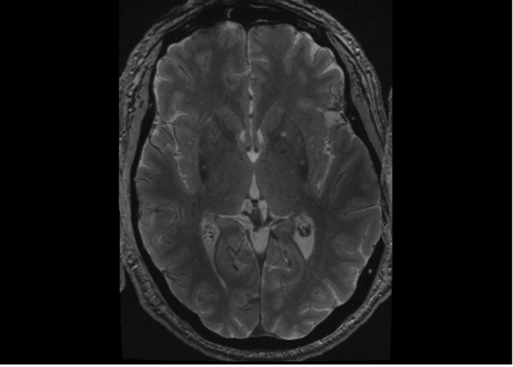
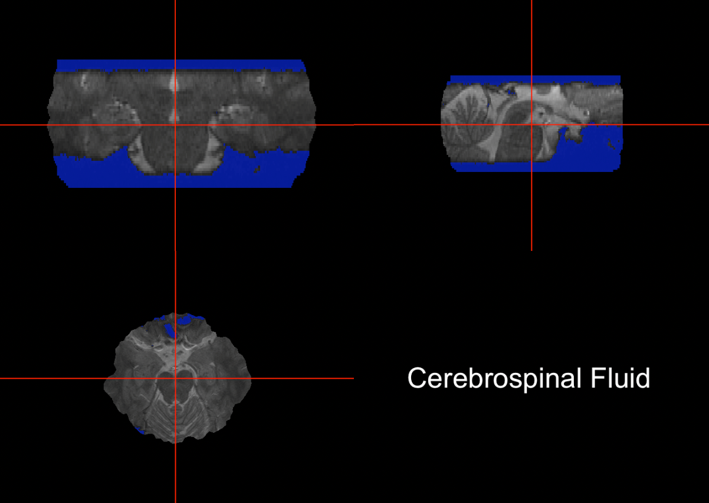
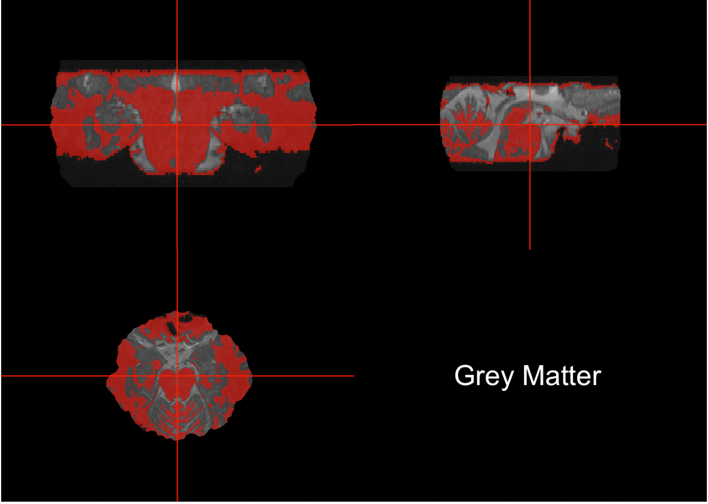
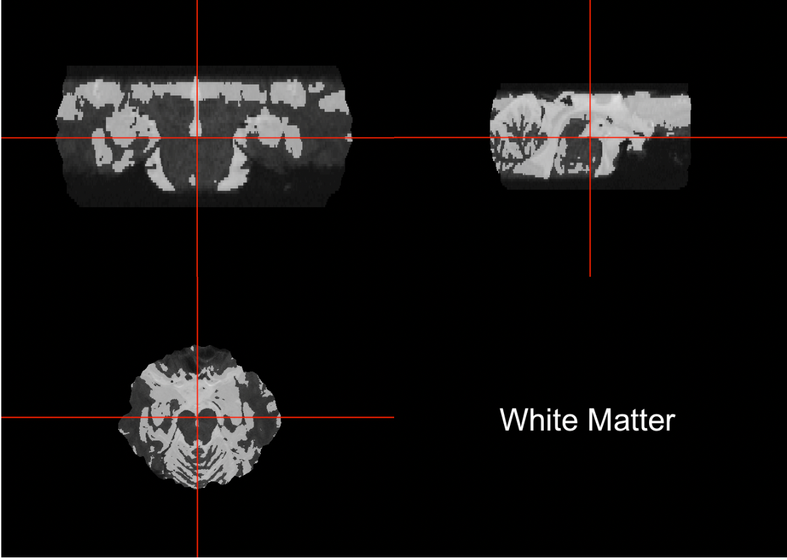

  Although R is primarily used for data analysis, it's open source framework can be neurohacked i.e., used for the processing and analysis of neuroimaging data. therefore, R provides a free alternative to some of the other commonly used neuroimaging data analysis software, such as MATLAB.   
  
  
  This tutorial will walk you through the basic steps of pre-processing MRI data.

* Let's begin... *
   You have just received the images from Participant 00001's brain scan from the radiologist. in most cases, you will find that for each participant there are dozens of files with the extension .dcm. .dcm is the extension for neuroimaging files in the DICOM or 'Digital Imaging and Communications in Medicine' is the standard representation of images that you'd expect to get right of a scanner or from a hospital archive. DICOM files contains both text as well as some properties of the image. Additionally, it can also contain some confidential information pertaining to the a patient's medical records. Moreover, DICOM files are _slice based_. which is the reason why each participant has quite a few dicom files. Each file contains text and image information from a _single slice_. Over the course of a canonical brain scan, many slices are acquired and as such, each slice is only a couple millimeter thick thereby providing an incomplete picture of the brain. So, if we want to conduct some serious brain analyses, it is more prudent to want to read in the entire image into R at one time. This can be done use the "oro.dicom" package's readDICOM function.

  
  Neuroimage analyses are typically not conducted in a DICOM format primarily because the structure for the DICOM images can be irksome, especially if we want to do analysis of the entire image. Therefore, a genuine 3D format(with only pixel data) is required. 
  The most common type of format used for neuroimaging analysis is called the NIFTI format. 

   Using the dicom2nifti function in the oro.dicom package, a dicom file can easily be converted to a nifti file within R. These images are 3-dimensional arrays and are therefore stacks of the individual slices from the DICOM images. 
NIFTI files have their own package in R known as the "oro.nifti"" package. Like the dicom package, this package uses the "read.NIFTI"" function to read the files into R. 

## Data Visualization  

Now, let's talk about visualizing the neuroumaging data. 

To demonstrate the process, I'll start by loading a NIFTI file called "NM_GRE_C43_CombEcho_s004.nii" into R using the following code. 

**library(oro.nifti)**

**mri_image <- readNIfTI("NM_GRE_C43_CombEcho_s004.nii", reorient=FALSE)**

Next I wanna get a sense of what the file contains,
**nrows <- dim(mri_image)[1]    ##how many rows of data does it have**

**ncols <- dim(mri_image)[2]    ### how many colums does it have **

**nslices <- dim(mri_image)[3]  ### how many slices.**

It looks like our data contains  rows, columns and slices

This is what the file looks like our data contains 480 columns 360 rows and 52 slices 

**image(mri_image)***

As you can see that the slices are barely discernible owing to their large number. 

Let's see if we could zoom into a single slice, say slice 45

**image(mri_image, z=45,plot.type="single") ***

Much better! 

### Inhomogenity correction

The next step in the process is applying a bias signal correction to the image. Bias field signal is a low-frequency and very smooth signal that corrupts MRI images. For this purpose, we will be depending on the fslr package in r. The fslr package contains R functions that interface with FSL, an open source software package commonly used for neuroimaging analysis. 

##install.packages("fslr")
**library(fslr)**
##bias extraction
**biascorrection <- fsl_biascorrect(mri_image,retimg = TRUE)***

Here is what the bias corrected image looks like for slice 45.

**image(biascorrection, z=45,plot.type="single")**

Not much different, eh? Well, not when you eyeball it. in reality, if we were to look at the difference between the two images, you will notice that  bias field correction is pivotal for getting the intensities of the images within a slice on a comparable scale. Which,as you will see in the next section, influences subsequent, more advanced analyses. 

### Brain Tissue Segementation

The human brain contains a variety of tissues. The more common ones are such grey matter (consisting mainly of cell bodies), white matter (nerve fibres) as well as the cerebrospinal fluid (a fluid that cushions the brain). These different tissue types are discernible on a brain scan since they have varying intensity. 

But before we jump into segmenting the brain tissue into these areas lets remove a major unceesary artifect from the images i.e., the skull.

Skull stripping can be achieved by using the fast function in the fslr package. 

**extract <- fast(bet)**

To segment the three different tissue types, we will use the function _fast_ from fslr. So the file that we'll put in for the segmentation is _extract_. The image bet, which is our segmentation, will consist of zero, ones, twos, and threes, where:

* Zero is the background, one will be for things that are part of CSF

* Two will be areas that are considered part of grey matter.

* Three will be areas that are considered part of white matter. 

We're going to use the ortho2 function, and we'll overlay the segmentation of the CSF, grey matter, and white matter, onto each of the images. So the first one we'll do is CSF. So we'll take our skull stripped image, and then we'll just put where fast equals one. This will produce an image of true and false, which will do our overlay, areas that are true will show up as blue and areas that are false will not show up.

**ortho2(bet,extract==1,col.y=alpha("blue",0.5),text="Cerebrospinal Fluid")**

And we'll do the same for grey matter(red) and white matter(white). 

**ortho2(bet,extract==2,col.y=alpha("red",0.5),text="Grey Matter")**

**ortho2(bet,extract==3,col.y=alpha("white",0.5),text="White Matter")**

Here we view a single slice from different planes namely, coronal(vertical plane that divides the brain into front and back sections), axial(superior and inferior division) and sagittal(right and left parts). 
