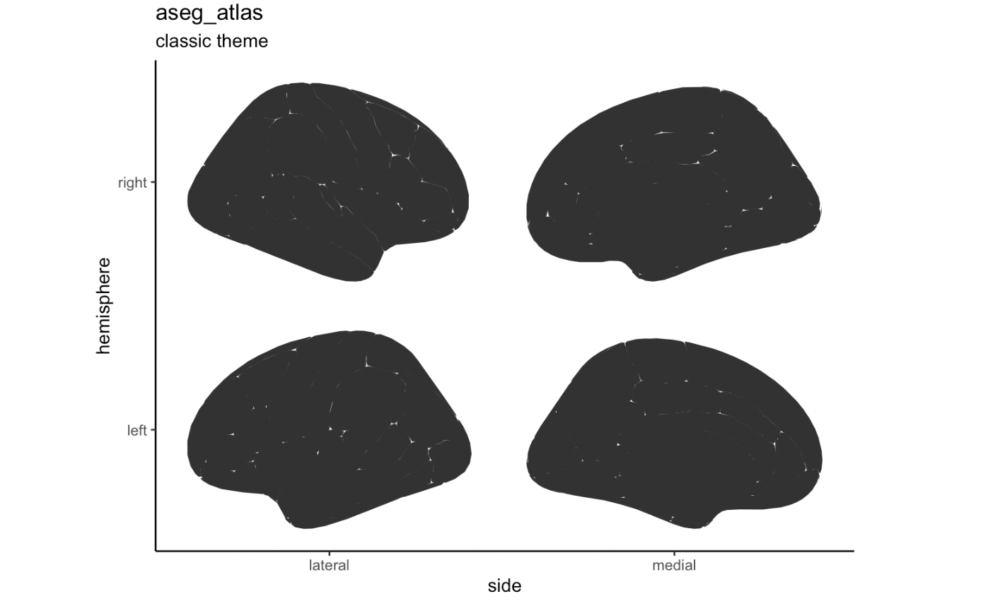
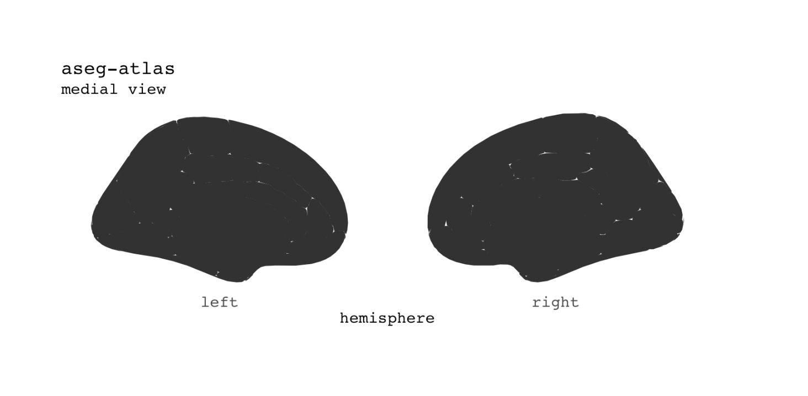
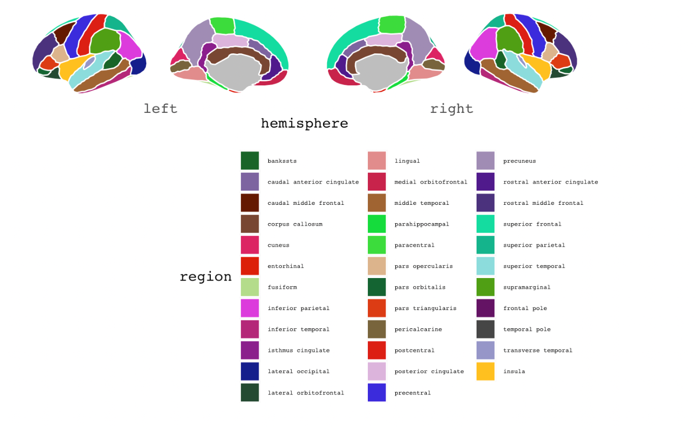
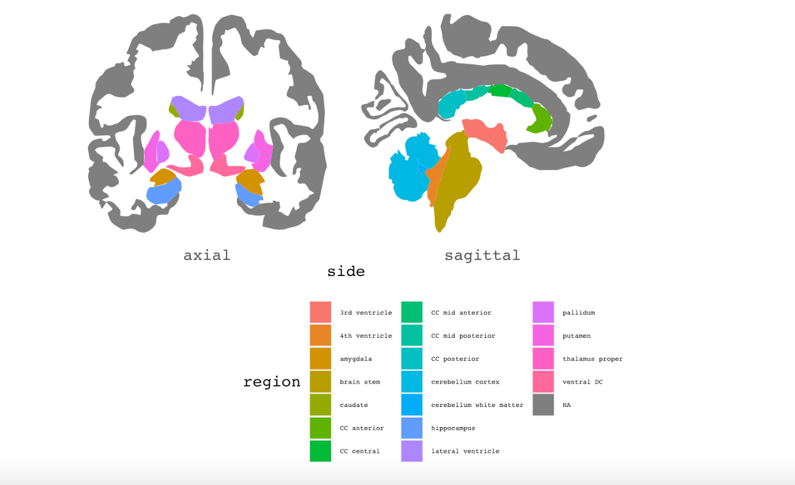
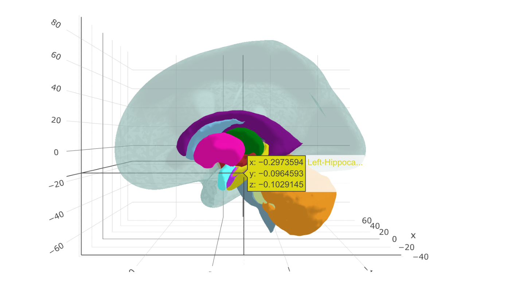
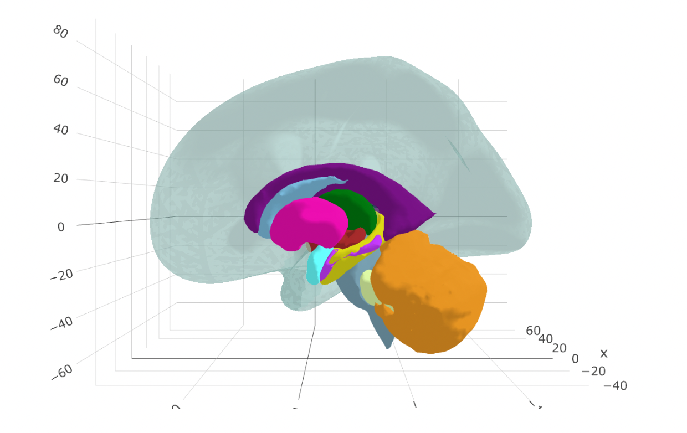

 As a psychology undergrad, I wasn't permitted to take the somewhat coveted neuroanatomy course that the neuroscience department offered at my undergraduate institution. This course was all the hype! Dissecting sheep brains, carefully studying brain structures with the help of atlases and coming out smelling like formaldehyde (too far?). During classes in cognitive neuroscience, I began to notice that those with courses such as neurophysiology  and neuroanatomy were better equipped to understand and appreciate the localization of function.
 
 I felt clearly disadvantaged. Although,  I am aware of the functioning of structures such as the percuneus, inferior frontal gyrus, and fornix, my ability to form connections and appreciate the structural and functional connectivity between various neuro-anatomical structures was lacking due to a lack of such fundamental knowledge.
  
  
 While there are some great software available online, access for me was limited by one simple problem.... MONEY!!! 
  
Alternative: Purchase a physical copy of an atlas and keep referring to it when in doubt.

Just when I was about to buy an atlas, I came across this incredibly cool feature in r that lets you visualize the brain in 2D **and** 3D. It's pretty neat actually! 

  The r package that let's you do a 2D analysis is called ggseg. ggseg relies on ggplot2. Infact, using _geom brain_ in ggplot also provides some basic neuroanatomical plots. But _ggseg_ and _ggsegExtras_ make visualization significantly more interactive and detailed.
  
  From an input standpoint, ggseg uses it's in-built atlases to display the brain from various vantage points. 
  
  Well, they say a picture is worth a thousand words so let's take a look

### Stacked Image
This is just a simple stacked image. 

**ggseg(atlas="dk",position = "stacked") +**
  **theme_classic() +**
  
  
  
  
  
  
  
  
  

As you might have noticed, the image lacks detail and gives a gross anatomy of the human brain.

 
 
  

### A Medial view with the aseg atlas 

Looking at the structures toward the midline of the brain 

***ggseg(atlas="aseg",position = "stacked") + theme_classic() +***

***labs(title = "aseg_atlas",***
***subtitle = "classic theme")***

    

Additionally, individual hemispheres can also be viewed from various ortientations e.g., lateral, inferior, superior. 

### Region Fill

You can also add legends and fill areas on the plot according to brain regions.  

**ggseg(mapping=aes(file=region),colour="white")+**

  ***scale_fill_brain("aseg")+***
  
  ***theme(legend.justification = c(1,0),legend.position = "right",***
  
  ***legend.text = element_text(size=6))+***
        
  ***guides(fill=guide_legend(ncols=3))***
  
  
  
  
  
  
  
  
  
  
  
  
  
  
  
     

    
### 2D Subcortical Structures    

Sub-cortical structures, e.g., basal ganglia, substantia nigra are embedded deep into the brain and can typically be seen after slicing the brain into two halves. This is where having had the experience of actually holding a brain in your hand really helps solidify information. Plus, these structures are relatively smaller than the cerebral cortices. 

Here, the brain is dissected into coronal sections (anterior and posterior halves) and sub-cortical structures are labelled. 

     
 
 
 
 
 
 
 
 
 
 
 
 
 
 
 
 
 
  
  
 
 
 
 

#### Now for the coolest one...
 
 
 
 The 3D atlas...
 
 In addition to the arguments taken by a 2D atlas, this takes the arguments of opacity and color for the background 

The functionality is especially great for visualizing the sub cortical structures that are buried deep under the cortex. What's more? it also labels them!You can also zoom or rotate the image and see it from multiple dimensions

   
   
    

    
    
    
    
    
    
    
    
**ggseg (atlas = "aseg",**

**mapping = aes(fill = region)) +**

***theme(legend.justification = c(1, 0), legend.position = "bottom" , legend.text = element_text(size = 5)) +***

  
 ***guides(fill = guide_legend(ncol = 3))***
 
 
 
 
 
 
 
 
 
 
  

  
_Suffice to say that I won't be needing an atlas anymore... :)_ 
                                 

